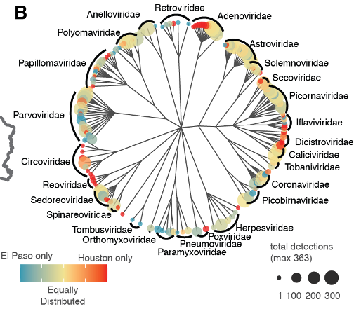
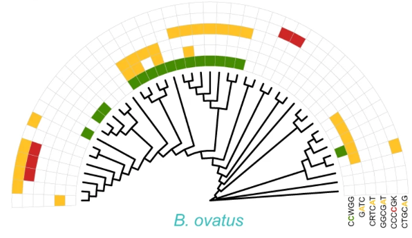
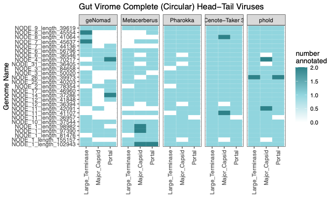

# Welcome to the Tisza Lab

[Publications and Software](/publications.md) | [Meet Our Team](/members.md) | [Contact Us](/contact.md) | [Home](/index.md)

## Advancing Microbial Genomics Research

Scientists' ability to conduct genomic sequencing on microbes and communities of microbes (metagenomes) has outpaced the ability to understand the meaning of those sequences. However, a deep understanding of genomic features and genomes is necessary to delineate the impact of microbes in health and disease. To accomplish this, we need powerful computation tools that generate testable predictions and the ability to test these predictions in the laboratory. That's where the Tisza Lab comes in.

### Research Focus Areas

- **Viral Pathogen Genomics**: From swabs to sewage, understanding viral evolution

  

- **Bacterial Epigenomics**: Understanding the diversity andfunctional impact of DNA modification in bacteria

  

- **Virus Discovery**: Discovering, annotating, and exploiting wild new viruses in and on the human body

  

#### Logo Credit
[Dr. Adrien Assie](https://github.com/aassie)